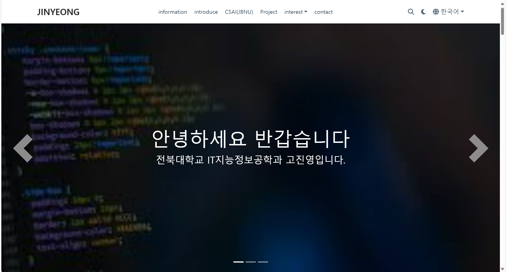

# [JINYEONG PORTFOLIO](https://github.com/wowchemy/starter-hugo-research-group)

휴고를 통해 포트폴리오 만들기

간편한 코드로 쉽게 개인 페이지를 만들 수 있습니다. ⭐⭐⭐⭐⭐

  

저는 홈페이지 첫면에는 슬라이더를 배치하여 간단한 자기소개와 제 페이지에 있는 콘텐츠들을 간단하게 보이게 배치했습니다.
메뉴탬으로는 제 소개, 저의 학과 관련 홈페이지, 제가 수행했던 프로젝트, 연락하는 방법, IT관련 흥미로운것들을 배치했습니다.
상단 가장자리에는 search 기능과 번역기능, 라이트모드, 다크모드를 배치했습니다.

여러분들도 저처럼 HUGO를 통해 쉽고 간편하게(?) 자신만의 포트폴리오를 만들어보세요

- 👉 [**시작하기**](https://hugoblox.com/hugo-themes/)
- 📚 [**휴고(HUGO)**참고사항](https://docs.hugoblox.com/)
- 💬 [Contact](https://discord.gg/YZsvCdQZ) o
- ⬇️ **BibTeX**이용해서 [Hugo Academic CLI](https://github.com/GetRD/academic-file-converter)

## 휴고를 통해 개인 페이지를 만들며

처음에는 생소한 언어와 github사용에 어려워서 갈아엎고, 또 엎고 했지만
그래도 꽤 만족스러운 결과물이 나와서 다행이라고 생각한다.
이번 기회에 개인페이지를 만들게 되어 너무 알차고 힘들었지만 기분은 좋았다.

## 참고 사이트

-아이콘 인용

- https://fontawesome.com/v5/icons/font-awesome?s=solid

-사진 인용

- https://unsplash.com/ko
